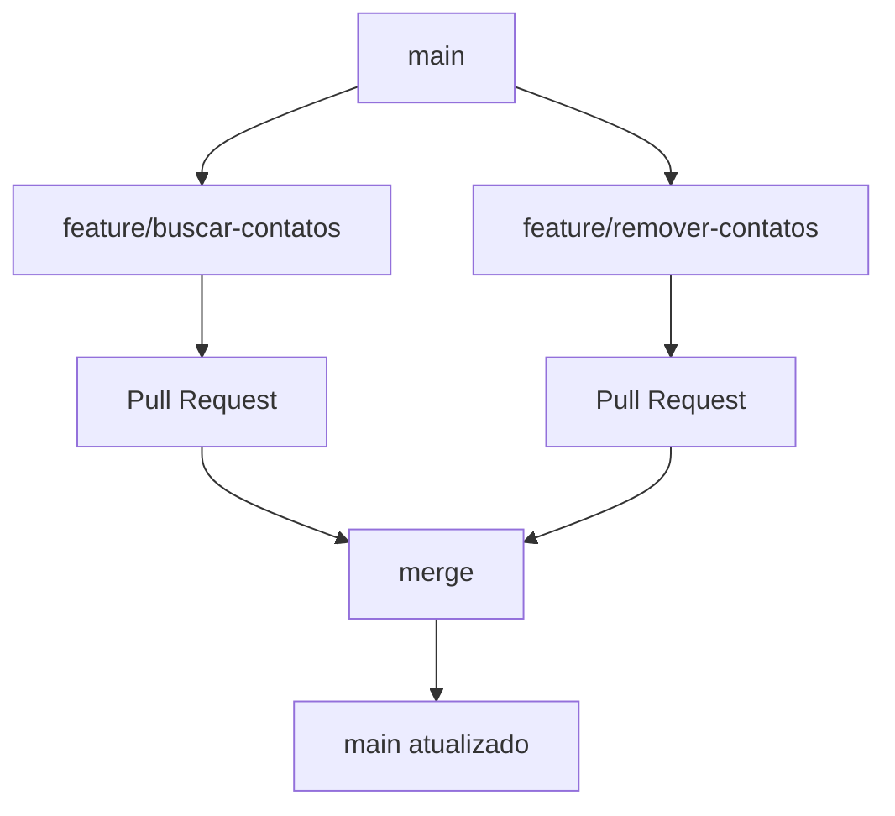

# 📒 Agenda de Contatos em Python

[](https://python.org)
[](https://git-scm.com)
[](https://github.com)
[](LICENSE)
[](CHANGELOG.md)

Uma aplicação de linha de comando para gerenciamento de contatos pessoais, desenvolvida como projeto acadêmico para demonstrar práticas de **Gerenciamento de Configuração de Software (GCS)**.

## 👥 Integrantes

| Nome | GitHub | Função Principal |
|------|--------|------------------|
| **Leticia Brondi** | [@brondileticia](https://github.com/brondileticia) | Funcionalidade de Busca |
| **Taissa de Pieri** | [@taissadepieri](https://github.com/TaissaPieri) | Funcionalidade de Remoção |

## 🚀 Funcionalidades

### ✅ Implementadas
- **📝 Adicionar contatos** - Nome, telefone e email
- **📋 Listar contatos** - Visualização completa da agenda
- **🔍 Buscar contatos** - Pesquisa inteligente por nome
- **🗑️ Remover contatos** - Exclusão segura de contatos

### 🎯 Próximas Funcionalidades
- [ ] Editar contatos existentes
- [ ] Salvar dados em arquivo
- [ ] Categorizar contatos
- [ ] Exportar para CSV

## 🛠️ Tecnologias Utilizadas

- **Python 3.8+** - Linguagem de programação
- **Git** - Controle de versão
- **GitHub** - Repositório remoto e colaboração
- **GCS** - Gerenciamento de Configuração de Software

## 📦 Estrutura do Projeto

```
ads-egsw-leticia-taissa/
│
├── 📄 agenda.py          # Aplicação principal
├── 📄 README.md          # Documentação do projeto
├── 📄 CHANGELOG.md       # Histórico de versões
├── 📄 .gitignore         # Arquivos ignorados pelo Git
└── 📄 LICENSE           # Licença MIT
```

## 🏃‍♂️ Como Executar

### Pré-requisitos
- Python 3.8 ou superior instalado
- Git para controle de versão

### 🖥️ Execução Local
```bash
# 1. Clone o repositório
git clone https://github.com/brondileticia/ads-egsw-leticia-taissa.git

# 2. Acesse o diretório
cd ads-egsw-leticia-taissa

# 3. Execute a aplicação
python agenda.py
```

### 🎮 Como Usar
1. Execute o programa: `python agenda.py`
2. Escolha uma opção do menu:
   - `1` - Adicionar novo contato
   - `2` - Listar todos os contatos
   - `3` - Buscar contato por nome
   - `4` - Remover contato
   - `5` - Sair do programa

## 🎯 Objetivo Acadêmico

Este projeto foi desenvolvido como **atividade prática** para a disciplina de **Engenharia de Software**, com foco em:

### 📚 Aprendizados de GCS
- ✅ **Controle de versão** com Git
- ✅ **Trabalho colaborativo** com branches
- ✅ **Versionamento semântico** (1.0.0, 1.1.0)
- ✅ **Pull Requests** e code review
- ✅ **Documentação** profissional
- ✅ **Rastreabilidade** de mudanças

### 🔄 Metodologia de Desenvolvimento
1. **Planejamento** - Definição de escopo e funcionalidades
2. **Implementação** - Desenvolvimento em branches separadas
3. **Integração** - Pull Requests e merge no main
4. **Versionamento** - Tags e releases
5. **Documentação** - README e CHANGELOG

## 📊 Processo de Desenvolvimento

### 🔀 Estratégia de Branches


### 🏷️ Versionamento Semântico
- **v1.0.0** - Versão inicial com adicionar/listar
- **v1.1.0** - Adição de buscar/remover contatos

### 📋 Convenções de Commit
- `feat:` Nova funcionalidade
- `fix:` Correção de bugs
- `docs:` Documentação
- `style:` Formatação de código

## 🗂️ Histórico de Versões

| Versão | Data | Funcionalidades | Desenvolvedores |
|--------|------|----------------|-----------------|
| 1.0.0 | 10-11-2025 | Adicionar, Listar | Leticia & Taissa |
| 1.1.0 | 10-11-2025 | Buscar, Remover | Leticia & Taissa |

*Para detalhes completos, veja [CHANGELOG.md](CHANGELOG.md)*

## 🤝 Como Contribuir

1. Faça um fork do projeto
2. Crie uma branch para sua feature (`git checkout -b feature/AmazingFeature`)
3. Commit suas mudanças (`git commit -m 'Add some AmazingFeature'`)
4. Push para a branch (`git push origin feature/AmazingFeature`)
5. Abra um Pull Request

## 📄 Licença

Este projeto está sob a licença MIT - veja o arquivo [LICENSE](LICENSE) para detalhes.

## 👨‍🏫 Disciplina

**Engenharia de Software**  
*Atividade: Gerenciamento de Configuração de Software (GCS)*  
**Professor:** Luiz Albano  
**Instituição:** IFSP Pirituba
**Período:** 2025/2

---

## 🔗 Links Úteis

- [📋 Board do Projeto](https://github.com/brondileticia/ads-egsw-leticia-taissa/projects)
- [🐛 Issues](https://github.com/brondileticia/ads-egsw-leticia-taissa/issues)
- [📊 Insights](https://github.com/brondileticia/ads-egsw-leticia-taissa/insights)

---

**Desenvolvido com 💙 por Leticia Brondi e Taissa de Pieri**  
*Projeto acadêmico - Engenharia de Software - 2025*
